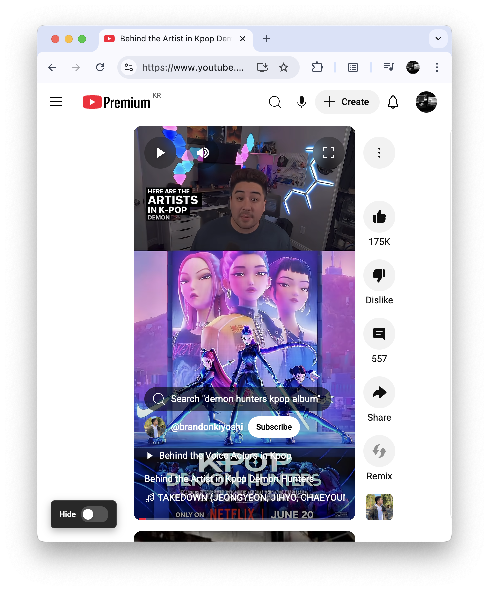
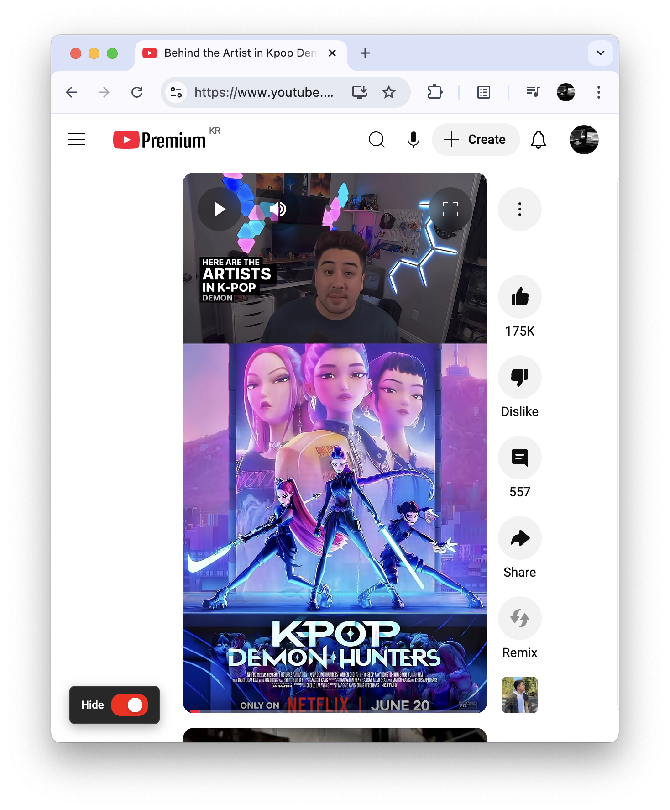

# YouTube Shorts Panel Hider Extension

  
  

A browser extension that allows you to hide the YouTube Shorts panel (metapanel) for a cleaner viewing experience.

## Features

- **Toggle Control**: Easy-to-use toggle button in the bottom-left corner
- **Persistent Settings**: Your preference is saved and remembered across sessions
- **Smooth Animations**: Modern YouTube-style toggle with smooth sliding animations
- **Non-Intrusive**: Minimal UI that doesn't interfere with your browsing experience

## How It Works

The extension targets YouTube's Shorts metapanel elements and provides a simple toggle to show/hide them. When enabled, the panel is hidden; when disabled, it's shown normally.

## Installation

1. Download the extension files from the `src/` folder (`manifest.json`, `content.js`, and `icon.png`)
2. Open your browser's extension management page
3. Enable "Developer mode"
4. Click "Load unpacked" and select the `src/` folder containing the extension files
5. Navigate to YouTube and you'll see the toggle button in the bottom-left corner

## Usage

- **Enable**: Click the toggle to hide the Shorts panel
- **Disable**: Click the toggle again to show the Shorts panel
- **Visual Feedback**: The toggle button slides left/right and changes color to indicate the current state

## Technical Details

- **Target**: YouTube Shorts metapanel elements with class `ytReelMetapanelViewModelHost`
- **Storage**: Uses localStorage to persist user preferences
- **Styling**: Modern YouTube-inspired design with blur effects and smooth transitions
- **Compatibility**: Works with YouTube's current interface

## Files

- `src/manifest.json`: Extension configuration and permissions
- `src/content.js`: Main functionality and UI implementation
- `src/icon.png`: Extension icon (128x128)
- `docs/`: Screenshots showing the extension in action

## Contributing

Feel free to submit issues or pull requests to improve the extension!

## License

This project is open source and available under the MIT License.
